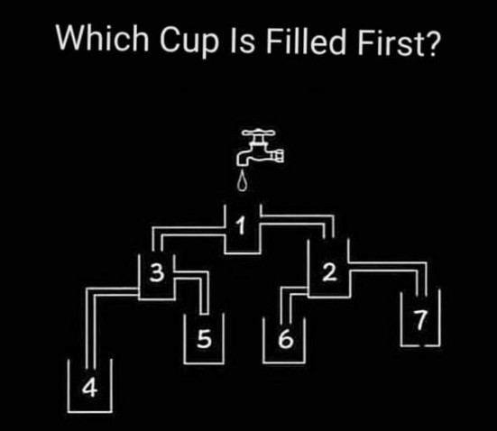

## 9. Có 25 con ngựa, cần tìm ra 3 con chạy nhanh nhất. Mỗi lần cho đua tối đa 5 con, kết quả dựa trên việc con nào tới đích trước mà không dựa theo đồng hồ. Giả định tốc độ của các con ngựa qua các vòng đua là không đổi thì số vòng đua tối thiểu để tìm ra 3 con ngựa chạy nhanh nhất?

## 10. Có 1 quả đồi đối xứng 2 bên với tổng độ dài từ chân dốc này sang chân dốc kia là 2km, 1 người chạy xe máy từ dưới chân đồi lên đỉnh đồi với vận tốc 15km/h, hỏi từ đỉnh đồi chạy xuống chân đồi bên kia phải đi với vận tốc bao nhiêu km/h để vận tốc trung bình của cả quảng đường là 30km/h?

## 4. Trả lời câu hỏi cho hình dưới đây

