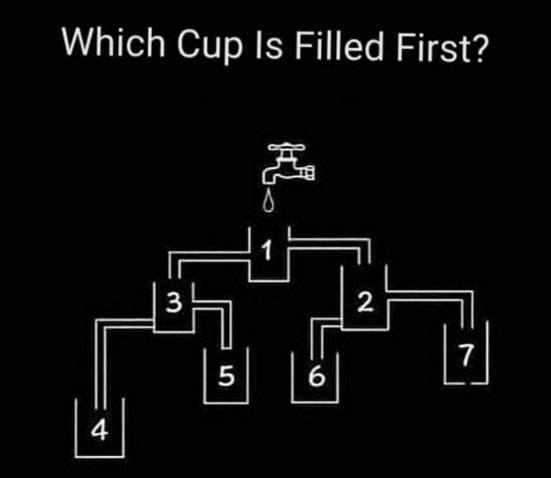

## 1. Kể về một dự án bạn đã tham gia mà bạn thấy tự hào. Bạn đã đóng góp như thế nào vào dự án và học hỏi được những gì?

## 2. Có 25 con ngựa, cần tìm ra 3 con chạy nhanh nhất. Mỗi lần cho đua tối đa 5 con, kết quả dựa trên việc con nào tới đích trước mà không dựa theo đồng hồ. Giả định tốc độ của các con ngựa qua các vòng đua là không đổi thì số vòng đua tối thiểu để tìm ra 3 con ngựa chạy nhanh nhất?

## 3. Có 1 quả đồi đối xứng 2 bên với tổng độ dài từ chân dốc này sang chân dốc kia là 2km, 1 người chạy xe máy từ dưới chân đồi lên đỉnh đồi với vận tốc 15km/h, hỏi từ đỉnh đồi chạy xuống chân đồi bên kia phải đi với vận tốc bao nhiêu km/h để vận tốc trung bình của cả quảng đường là 30km/h?

## 4. Trả lời câu hỏi cho hình dưới đây



## 5. Cho đoạn code sau, kết quả khi thực hiện đoạn code là gì? Giải thích.

```
const greeting = name=>message=>`${message} ${name}`
const greetingJohn = greeting('John')
greetingJohn('Good morning') // => ?
```

## 6. Thứ tự xuất hiện của các số là gì theo đoạn code dưới đây?

```
(function() {
    console.log(1);
    setTimeout(function(){console.log(2)}, 1000);
    setTimeout(function(){console.log(3)}, 0);
    console.log(4);
})();
```

## 7. Cho đoạn code sau, kết quả khi thực hiện đoạn code là gì? Giải thích.

```
var hero = {
    _name: 'John Doe',
    getSecretIdentity: function (){
        return this._name;
    }
};

var stoleSecretIdentity = hero.getSecretIdentity;

console.log(stoleSecretIdentity());
```

## 8. Cho đoạn code sau, nhận xét điểm chưa tốt và nêu cách khắc phục

```
function whenCreate(){
 var role = myServer.getSessionRole();

 if (role == 0){
     createStudent();
 }
}

function whenEdit(){
 var role = myServer.getSessionRole();

 if (role == 0){
     editStudent();
 }
}

function whenDelete(){
 var role = myServer.getSessionRole();

 if (role == 0){
     deleteStudent();
 }
}
```

## 9. Bạn có thuật toán yêu thích nào không? Nếu có thì vì sao bạn thích nó và bạn đã ứng dựng nó như thế nào trong công việc?
