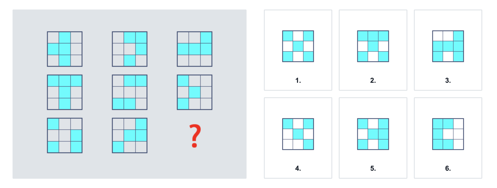
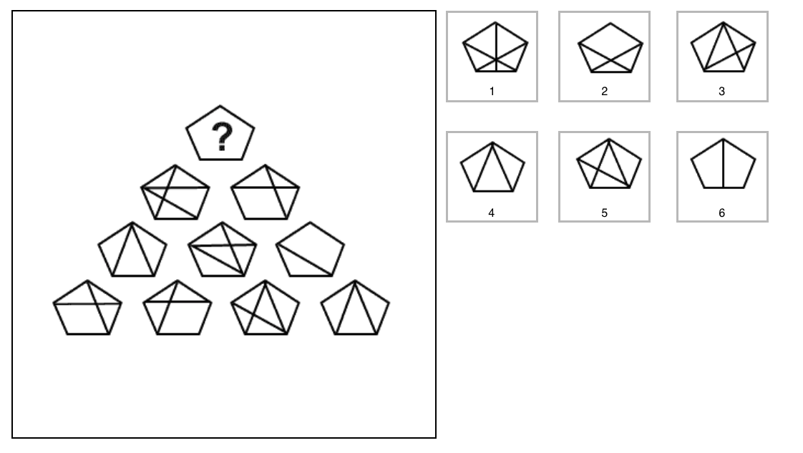
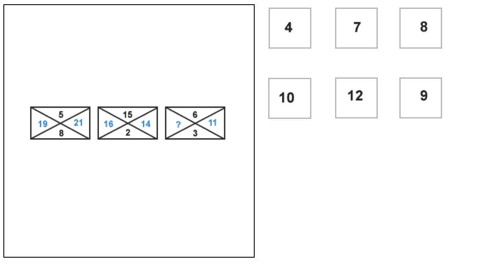
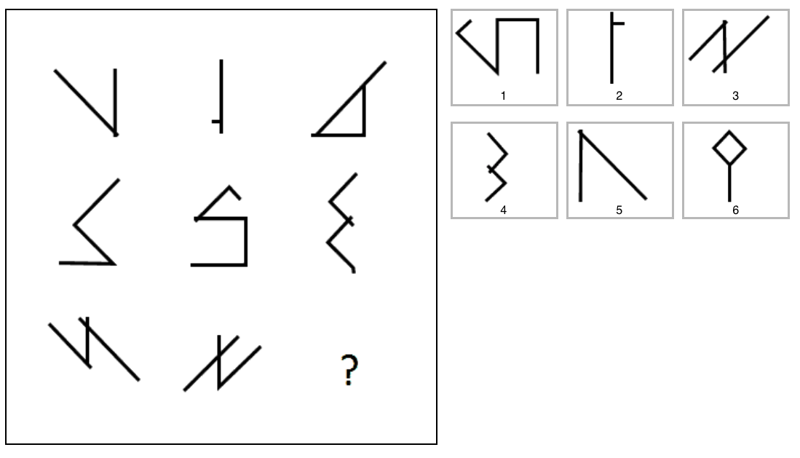
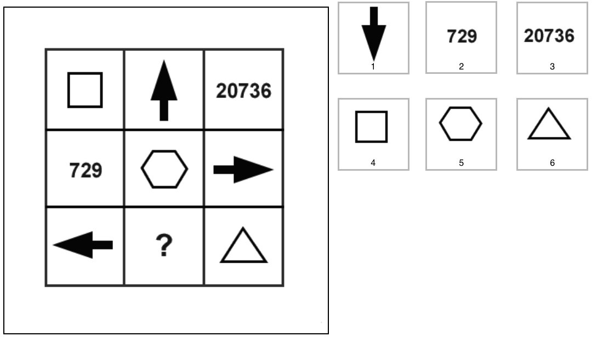
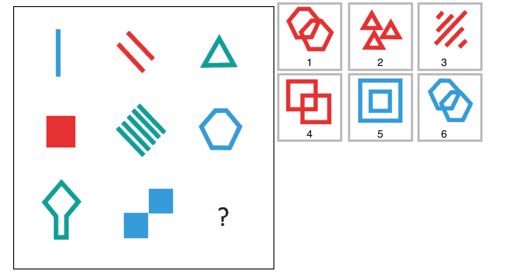
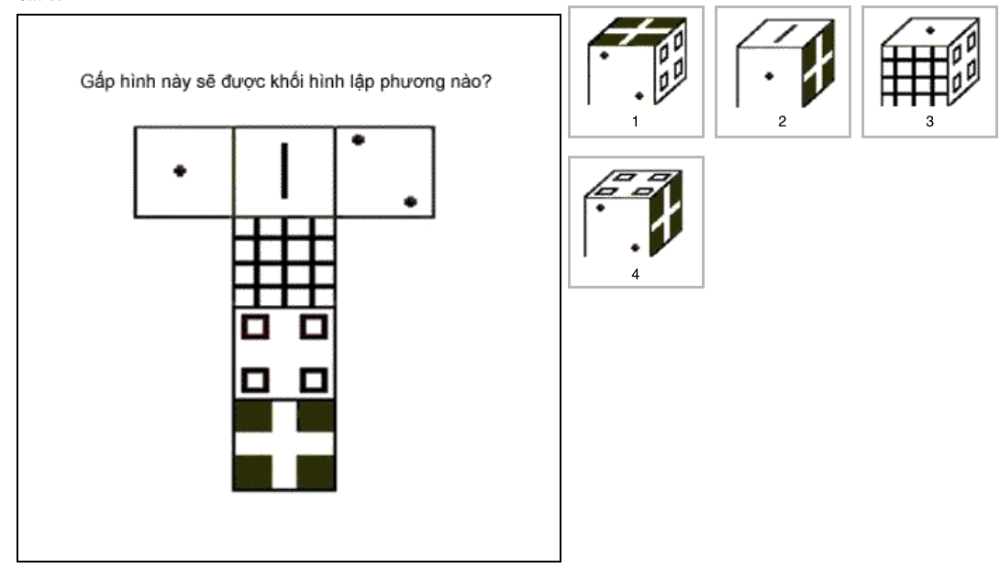

# Backend developer questions

## 1. Thêm các biểu thức toán học (+, -, \*, /, !, 2 ) để có phép toán đúng: (1 điểm)

### 0 0 0 0 0 = 120

## 2. Thêm các biểu thức toán học (+, -, \*, /, !, 2 ) để có phép toán đúng (Khuyến khích đưa ra nhiều đáp án.) (1 điểm)

### 3 1 3 6 = 8

## 3. Điền số phù hợp với cả 2 dãy số bên dưới vào dấu "?" và giải thích. (1.5 điểm)

### 119 | 108 | 99 | 81 | ?

### 117 | 108 | 90 | 81 | ?

## 4. Điền hình còn thiếu vào dấu "?" (1 điểm)

## 5. Tìm hình phù hợp điền vào dấu "?" (1 điểm)

## 6. Tìm số còn thiếu trong dấu "?" (1 điểm)

## 7.Tìm hình phù hợp điền vào dấu "?" (1.5 điểm)

## 8. Điền vào dấu "?" (1.5 điểm)

## 9. Điền hình còn thiếu vào dấu "?"

## 10. Trả lời câu hỏi trong hình dưới đây.

