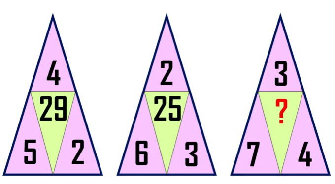

# Backend developer questions

## 1. Điền số tiếp theo vào dãy

### 119 | 108 | 99 | 81 | ?

## 2. Thêm các biểu thức toán học (+, -, \*, /, !, 2 ) để có phép toán đúng:

### 0 0 0 0 0 = 120

### 3 1 3 6 = 8

## 3. Trả lời câu hỏi cho hình dưới đây

## 4. Điền số còn thiếu vào dấu "?"

## 5. Có 25 con ngựa, cần tìm ra 3 con chạy nhanh nhất. Mỗi lần cho đua tối đa 5 con, kết quả dựa trên việc con nào tới đích trước mà không dựa theo đồng hồ. Giả định tốc độ của các con ngựa qua các vòng đua là không đổi thì số vòng đua tối thiểu để tìm ra 3 con ngựa chạy nhanh nhất?
